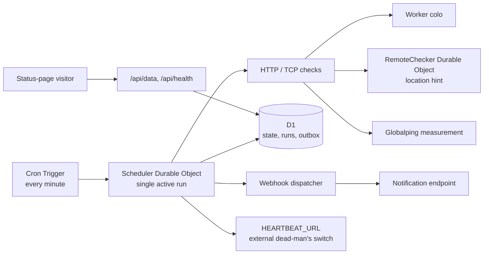

# uptime-worker

Cloudflare Worker uptime monitoring with a D1-backed status store, a Durable Object scheduler, and durable notification delivery.

It serves a static status page, runs checks every minute, records monitoring state in D1, and keeps notification work in a D1 outbox until delivery is confirmed.

## Architecture

## Features

- A static status page with `/api/data`, badges, and `/api/health`.
- A singleton Scheduler Durable Object prevents overlapping scheduled runs.
- D1 stores state, run records, and a durable notification outbox; deliveries are **at-least-once**.
- Local Worker, Durable Object location-hint, Globalping, and allowlisted custom-proxy checks.
- An optional external heartbeat reports that the monitor itself completed a run.

## Quick start

1. Fork this repository, clone your fork, then run `npm ci` (Node.js 22.13.0 or later).
2. Edit `uptime.config.ts` to add your monitors and status-page metadata.
3. Create the D1 database with `npm run d1:create`, then copy the returned database ID into the `UPTIME_WORKER_D1` binding in `wrangler.toml`. Initialize it with `npm run d1:migrate:remote`.
4. Validate the artifact with `npm run deploy:dry-run`, then run `npm run deploy` once to create the Worker.
5. Set every secret used by your enabled configuration (the table below lists the names) and verify `/api/health`. `npx wrangler secret put <SECRET_NAME>` updates an existing Worker, so it follows the initial deploy.

For local development, create a gitignored `.dev.vars` file beside `wrangler.toml` and use only placeholders, for example `TG_BOT_TOKEN=<SECRET_VALUE>`. Then run `npm run d1:migrate:local` followed by `npm run dev`. Do not commit `.dev.vars`.

To deploy a fork, make the same D1 binding and secrets in the fork's Cloudflare account. The Worker name, D1 database name, Durable Object bindings, migrations, static-assets binding, and cron trigger are defined in `wrangler.toml`; keep documentation and automation aligned with those names.

## Secrets

After the Worker exists, set a deployed secret interactively with `npx wrangler secret put <SECRET_NAME>`; replace `<SECRET_NAME>` with a name from this table. The command's prompt receives the value, so values never need to appear in shell history or source control. Cloudflare documents that `wrangler secret put` creates and immediately deploys a new Worker version; use the version-based workflow when you need gradual deployment. [Workers secrets](https://developers.cloudflare.com/workers/configuration/secrets/)

| Secret | Used by | Required when |
| --- | --- | --- |
| `TG_BOT_TOKEN` | Telegram webhook URL in the sample notification | Telegram notification is enabled |
| `TG_CHAT_ID` | Telegram webhook payload in the sample notification | Telegram notification is enabled |
| `VPS1_IP` | TCP monitor target in the sample configuration | That monitor is enabled |
| `VPS1_PORT` | TCP monitor target; defaults to `22` at runtime | A non-default port is needed |
| `HOMELAB_HOST` | TCP monitor target in the sample configuration | That monitor is enabled |
| `HOMELAB_PORT` | TCP monitor target in the sample configuration | That monitor is enabled |
| `HEARTBEAT_URL` | External dead-man's-switch GET request | Monitoring the monitor is enabled |

Every `<SECRET_NAME>` reference in `uptime.config.ts` is resolved before a scheduled run begins. A missing, empty, or unresolved value makes that run fail closed: no fabricated target or notification is used. `HEARTBEAT_URL` is deliberately optional; if absent, the external heartbeat is skipped rather than treated as a check target.

## D1 migrations

Deployments and local development apply the ordered SQL files in `migrations/`. Do not run `deploy/init.sql` during normal deployment.

### New install

1. Create the database with `npm run d1:create`.
2. Put the returned database ID in `wrangler.toml`.
3. Initialize the remote database with `npm run d1:migrate:remote`.
4. For local development, run `npm run d1:migrate:local` to apply the same migrations locally.

### Compatibility install

For an existing installation that was initialized from `deploy/init.sql`, keep the existing database and its ID. Run `wrangler d1 migrations apply uptime_worker_d1 --remote` once before the next deployment. The migrations use idempotent `CREATE ... IF NOT EXISTS` statements, so this records the migration history without replacing existing tables or data.

`deploy/init.sql` remains only as a compatibility schema snapshot for legacy/manual recovery. CI and package scripts use D1 migrations, and future schema changes belong in `migrations/`.

## Monitoring the monitor

Set `HEARTBEAT_URL` to the unique HTTPS ping URL supplied by an external service such as Healthchecks or Better Stack. After a persisted scheduled run, the Scheduler sends one GET request to that URL. Configure the external monitor for a one-minute expected period and a three-minute grace period: this mirrors the Worker cron and `/api/health` becoming stale after 180 seconds. A successful heartbeat means the monitoring run reached that boundary; it does not mean every target was up.

Use `/api/health` for a second, direct health signal. It returns HTTP 200 only when the most recent state is healthy; it returns 503 while initializing, delayed, stale, or unavailable. See [operations](docs/operations.md) for expected responses and incident procedures.

## Check locations

Without `checkProxy`, a check runs from the current Worker colo and a public three-letter colo value may be displayed. `worker://LOCATION_HINT` routes the check through a RemoteChecker Durable Object named from the monitor ID and hint; the hint influences Durable Object placement but does not promise a specific city, and the location shown is the colo observed by that Worker invocation.

`globalping://TOKEN?magic=LOCATION` submits a Globalping measurement. Its public location is the result's `country/city`, not a Cloudflare colo. Custom HTTP(S) proxy locations are intentionally never exposed in the public API. A custom proxy must set `checkProxyAllowedHosts` to its hostname; see `uptime.config.ts` for the safe example.

## Security and privacy

Secrets stay in Cloudflare secret storage or `.dev.vars`, never in `wrangler.toml`, source, issues, or logs. The custom proxy receives a small monitor DTO over POST; it does not receive the monitored request's `Authorization` or `Cookie` headers, and redirects are rejected.

Logs use an allowlist of operational fields only: event name, `monitorId`, `runId`, status/boolean values, duration, ping, location/measurement identifiers, webhook host and method, and error category. They must not include webhook URLs, tokens, request headers, bodies, target URLs when sensitive, or external heartbeat URLs.

Cloudflare limits and pricing vary by plan and change over time. Before sizing monitors, read the official [Workers limits](https://developers.cloudflare.com/workers/platform/limits/), [D1 limits](https://developers.cloudflare.com/d1/platform/limits/), and [pricing](https://developers.cloudflare.com/workers/platform/pricing/) pages rather than relying on a copied free-tier quota.
